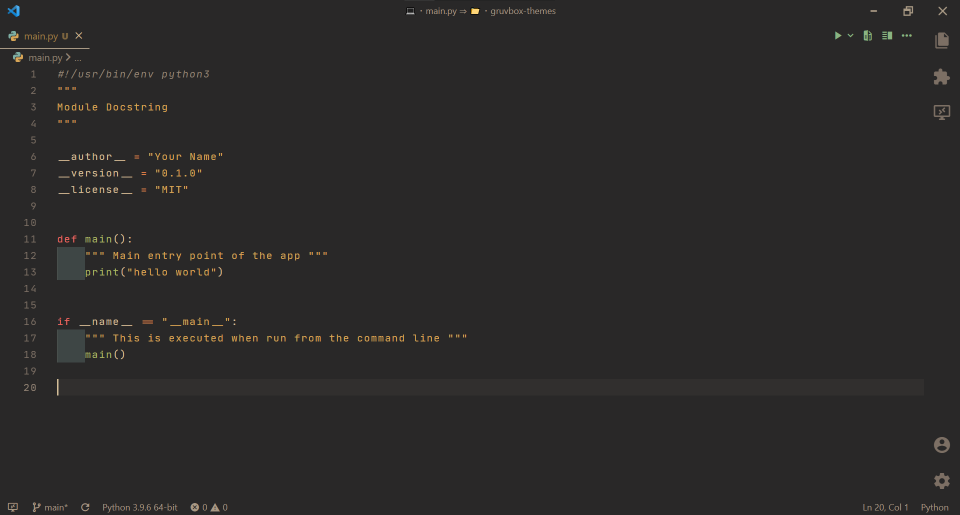

# Gruvbox Themes

```
Gruvbox Themes is a theme pack of gruvbox themes and icons to prettify your ide
```

> ✔️ All themes and icons work on vscodium


### <u>Preview</u>
<details>
    <summary>
        <code>click here for preview</code>
    </summary>
    
</details>
<br>

## Extensions Included
#
### <u>Themes</u>
<br>

* [Gruvbox Material](https://marketplace.visualstudio.com/items?itemName=sainnhe.gruvbox-material) - Gruvbox with Material Palette
#
### <u>Icons</u>
<br>

* [Gruvbox Material Icon Theme](https://marketplace.visualstudio.com/items?itemName=JonathanHarty.gruvbox-material-icon-theme) - Gruvbox Material Icons
* [Material Product Icons](https://marketplace.visualstudio.com/items?itemName=PKief.material-product-icons) - Product Icon Theme with Material Icons for VS Code

#
## Have a suggestion?
<br>

feel free to open a pull request!
> 🔗 link: [<u>here</u>](https://github.com/ext8/gruvbox-themes/pulls)
#
## License

[<u>MIT</u>](https://github.com/ext8/gruvbox-themes/blob/HEAD/LICENSE)